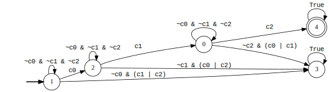
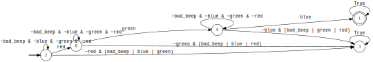
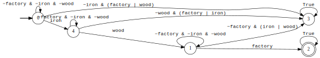

# Transfer Learning over Heterogeneous Agents with Restraining Bolts 

In this page, we describe the experiments of the submission 
"Transfer Learning over Heterogeneous Agents with Restraining Bolts"
at ICAPS 2020, submitted to the "Planning and Learning" track.

You can find the code to reproduce them at 
[this link](https://github.com/icaps2020submission-190/icaps2020submission-190.github.io).

## Experiment setup

To make easier the assessment of the quality of the learned policy,
each experiment follows the structure below:
- we fixed a restraining bolt [1] in LTLf/LDLf.
- then, we play a simplified variant (Variant A) of the game recording 
  its traces (projected on fluents only) and labeling the good or 
  bad according to the satisfaction of the LTLf formula. In this way, 
  we generate an “expert behavior” that can be used later for 
  assessing the quality of the policy learned (see later). 
- then we learn the DFA from the traces. 
  (Such a DFA typically is not the same as the  LTLf formula but 
  it is close enough). 
- next, the learner learns a policy in the more complex game 
  (Variant B) using  the learned DFA as the restraining bolt.
- finally, to assess the policy learned we simulate its execution together 
  with the original LTLf DFA checking when we reach its final states.

The actions in Variant A and Variant B are different. 
In particular, in Variant A, actions are stronger, making the 
game easier. 

The traces that we consider are generated by playing an easier game
(Variant A) wrt to the one that we then use for 
learning the policy (Variant B). 
In fact we use Variant A only to get the DFA constituting the 
restraining bolt that is then used to synthesize a behavior 
for Variant B.

Notice that there must be a relationship between the actions 
in the two variants for making the approach effective in practice, 
but such a relationship can be quite loose and can remain unexpressed.

Note also that actions are not used in the alphabet to progress the 
DFA and hence are not part of the reward given by the restraining bolt. 
This allows us to have different actions in the two variants.

We tested our approach in 3 different environments (the same used
in [1]):

- [Breakout](https://github.com/sapienza-rl/gym-breakout-pygame/tree/980952a781164e2bec5fe99889a811f4dc67ea9c):
  an implementation of the popular Atari game in Pygame.
- [Sapientino](https://github.com/sapienza-rl/gym-sapientino/tree/bcc22aae932cbd677e426d3ce4832c7d96c3940e): 
  environment inspired by _Sapientino_, an educational game for children.
- [Minecraft](https://github.com/sapienza-rl/gym-minecraft-pygame/tree/25c9db7deeaefe135ca2e838ba29cdcd6e21c868): 
  Minecraft-like environment implemented with Pygame

## Breakout

### Variant A

The variant A of the Breakout environment is defined as follows:

- The state space $S = P_x$ is the set of all the 
  possible $x$ positions of the 
  paddle: $\\{x_0, x_1, \dots, x_{width} \\}$
- The action space $A = \\{ left, right, nop, fire \\}$
- The reward function $R(s, a, s')$ is a positive number $r_b$ when
  a brick is removed, $0$ otherwise.

The environment is deterministic.

### Variant B

The variant B of the Breakout environment is defined as follows:

- The state space $S = P_x \times B_x \times B_y \times V_x \times V_y$  
  where:
  - $P_x$ is the set of all the possible $x$ positions of the paddle;
  - $B_x$ and $B_y$ are, respectively, the set of all the possible 
    $x$ and $y$ ball positions;
  - $V_x$ and $V_y$ are, respectively, the set of all the possible 
    (discrete) $x$ speed and $y$ speed of the ball;
- The action space $A = \\{left, right, nop\\}$
- The reward function $R(s, a, s')$ is defined as in variant A.

The environment is deterministic.

### Experiment

The LDLf formula that defines the Restraining Bolt is:

$$
\langle (\lnot c_1 \wedge \lnot c_2 \wedge \lnot c_3)^*;
c_1;(\lnot c_1 \wedge \lnot c_2 \wedge \lnot c_3)^*;
c_2;(\lnot c_1 \wedge \lnot c_2 \wedge \lnot c_3)^*;
c3 \rangle tt $$

Where $c_i$ means: the $i_{th}$ column of bricks has just been broken.

The restraining bolt is endowed with sensors in order to 
detect the presence or absence of bricks, and hence to
determine at a certain time whether fluent $c_i$ is true or not.

The equivalent DFA is:

    

The expert behaviour is learned as in [1]. Follows a recording of
such behaviour:

    
    
Expert behaviour for Variant A of Breakout.

The (unique) example of positive trace is $c_1,c_2,c_3$.
Some examples of negative traces are:
- the empty trace: no column removed;
- $c_0$: only the first column has been removed;
- $c1;c0;c2$: removed, in this order the second, the first and the third column.
- $c2;c1$: removed the third and the second columns.

Notice that we filter out steps of the traces that have no fluents
(i.e. empty propositional interpretations).

You can find examples of the produced traces in 
[positive_traces.txt](https://github.com/icaps2020submission-190/icaps2020submission-190.github.io/blob/code/examples/breakout-output/positive_traces.txt)
and 
[negative_traces.txt](https://github.com/icaps2020submission-190/icaps2020submission-190.github.io/blob/code/examples/breakout-output/negative_traces.txt)

The automaton learned from the traces is:

    

The labels are in brackets because they have to be intended as 
propositional interpretations. We also assume that every state 
of the DFA has a loop transition with the empty propositional 
interpretation, that is intended to be true if no other fluent is true.

And this is a recording of the optimal policy 
learned by the learner agent.

    
    
Learner behaviour for Variant B of Breakout.

Notice that it is able to learn the same goal by just observing 
the traces of fluents produced by the expert. 
We also stress the fact that the expert can only fire, 
whereas the learner  can only use the ball, 
meaning that the knowledge of the goal can 
be transferred even across different agents.

## Sapientino

### Variant A

The variant A of the Sapientino environment.

- the state space $S = Ag_x \times Ag_y$, that is the $(x, y)$ 
  coordinates of the agent in a grid.
- the action space $A = \\{up, down, right, left, beep, nop\\}$ to move
  on the grid.
- the reward function $R(s, a, s')$:
    - $-1$ if the agent tries to move outside the grid;
    - $-1$ if the agent does a 'beep' action in an illegal cell
      (either a blank cell or a coloured cell already visited);
    - $-0.01$ at each transition;

### Variant B 

The variant B of the Sapientino environment.

- the state space $S = Ag_x \times Ag_y \times \Theta$, 
  that is the $(x, y, \theta)$ where $x$ and $y$ are defined as
  before and $\theta \in \\{0, 90, 180, 270\\}$
  to capture the orientation of the agent.
- the action space $A = \\{turn\\_right, turn\\_left, forward, backward, beep, nop\\}$ 
  to move on the grid.
  on the map.
- the reward function $R(s, a, s')$ is defined as in variant A.

### Experiment

The LDLf formula that defines the Restraining Bolt is:

$$
\langle(\lnot bad\_beep \wedge \lnot red \wedge \lnot green \wedge \lnot blue)^*;\\
red;(\lnot bad\_beep \wedge \lnot red \wedge \lnot green \wedge \lnot blue)^*;\\
green;(\lnot bad\_beep \wedge \lnot red \wedge \lnot green \wedge \lnot blue)^*;\\
blue \rangle tt
$$

Where:
- $[color]$ means: a color has been "visited" correctly (i.e.
  the robot did a "beep" action on the cell with that color, and 
the cell has not been visited earlier)
- $bad\\_beep$: this fluent is activated when the robot does a bad beep,
  e.g. when on a blank cell, or on a colored cell already visited.

In english, the goal can be stated as: _visit the colors 
in a certain order, without any bad beep or wrong color visited in 
between_.

The restraining bolt is endowed with sensors in order to 
detect whether the robot is on a colored cell and whether 
it has just executed the action "beep", hence it is able
determine at every step whether the fluents are true not.

The equivalent DFA is:

    

The expert behaviour is learned as in [1]. Follows a recording of
such behaviour:

    
    
Expert behaviour for Variant A of Sapientino.

The (unique) example of positive trace is $red;green;blue$.
Some examples of negative traces are:
- the empty trace: no color visited;
- $blue$: only the blue color is visited;
- $red;green;green$: the green color has been visited twice.

Notice that we filter out steps of the traces that have no fluents
(i.e. empty propositional interpretations).

You can find examples of the produced traces in 
[positive_traces.txt](https://github.com/icaps2020submission-190/icaps2020submission-190.github.io/blob/code/examples/sapientino-output/positive_traces.txt)
and 
[negative_traces.txt](https://github.com/icaps2020submission-190/icaps2020submission-190.github.io/blob/code/examples/sapientino-output/negative_traces.txt)

The automaton learned from the traces is:

    

And this is a recording of the optimal policy 
learned by the learner agent.

    
    
Learner behaviour for Variant B of Sapientino.

## Minecraft

### Variant A

The variant A of the Minecraft environment.

- the state space $S = Ag_x \times Ag_y$, that is the $(x, y)$ 
  coordinates of the agent in a grid.
- the action space $A$:
  - $nop$, do nothing.
  - $goto\\_wood$, move to the location where the resource "wood" is located.
  - $goto\\_grass$, the same, but for the "grass"
  - $goto\\_iron$, the same, but for the "iron"
  - $goto\\_toolshed$, move to the location where the tool "toolshed" is located.
  - $goto\\_workbench$, the same, but for the "workbench" 
  - $goto\\_factory$, the same, but for the "factory"
  - $get$, get a resource
  - $use$, use a resource

- the reward function $R(s, a, s')$:
    - $-1$ if the agent tries to move outside the grid;
    - $-1$ if the agent does a 'get' action in an illegal cell
      (either a blank cell or on a non-resource cell, 
      or a resource already visited.);
    - $-1$ if the agent does a 'use' action in an illegal cell
      (either a blank cell or on a non-tool cell, 
      or a tool already visited.);
    - $-0.01$ at each transition;

### Variant B 

The variant B of the Minecraft environment.

- the state space $S = Ag_x \times Ag_y \times \Theta$, analogous to 
  Variant B of Sapientino. 
- the action space $A = \\{turn\\_right, turn\\_left, forward, backward,
   use, get, nop\\}$ to move 
  on the grid, to get/use resources/tools, and to do nothing.
- the reward function $R(s, a, s')$ is defined as in variant A.

### Experiment

The LDLf formula that defines the Restraining Bolt is:

$$
\langle (\lnot factory \wedge \lnot iron \wedge \lnot wood)^*;\\
iron;(\lnot factory \wedge \lnot iron \wedge \lnot wood)^*;\\
wood;(\lnot factory \wedge \lnot iron \wedge \lnot wood)^*;\\
factory>tt
$$

Where:
- $[resource|tool]$ means: a tool/resource has been used/got correctly 
  (i.e. the robot did a "use/get" action properly as described above.

In english, the goal can be stated as: _get iron, then get wood, and 
then use factory, without other operation in between._

The restraining bolt is endowed with sensors in order to 
detect whether the robot is on a resource/tool cell and whether 
it has just executed the action "get" or "use", hence it is able
determine at every step whether the fluents are true not.

The equivalent DFA is:

    

The expert behaviour is learned as in [1]. Follows a recording of
such behaviour:

    
    
Expert behaviour for Variant A of Minecraft.

The (unique) example of positive trace is $iron;wood;factory$.
Some examples of negative traces are:
- the empty trace: no relevant action done;
- $wood$: only the wood resource has been collected;
- $iron;wood;toolshed$: used the wrong tool.

Notice that we filter out steps of the traces that have no fluents
(i.e. empty propositional interpretations).

You can find examples of the produced traces in 
[positive_traces.txt](https://github.com/icaps2020submission-190/icaps2020submission-190.github.io/blob/code/examples/minecraft-output/positive_traces.txt)
and 
[negative_traces.txt](https://github.com/icaps2020submission-190/icaps2020submission-190.github.io/blob/code/examples/minecraft-output/negative_traces.txt)

The automaton learned from the traces is:

    

And this is a recording of the optimal policy 
learned by the learner agent.

    
    
Learner behaviour for Variant B of Minecraft.

## References

1. De Giacomo, Giuseppe, et al. "Foundations for restraining bolts: 
      Reinforcement learning with LTLf/LDLf restraining specifications." 
      Proceedings of the International Conference on Automated Planning and Scheduling. 
      Vol. 29. No. 1. 2019.

